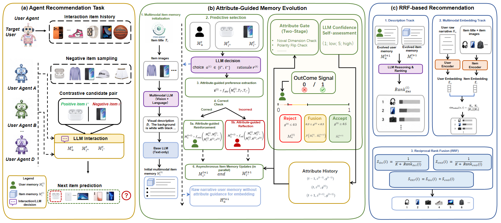
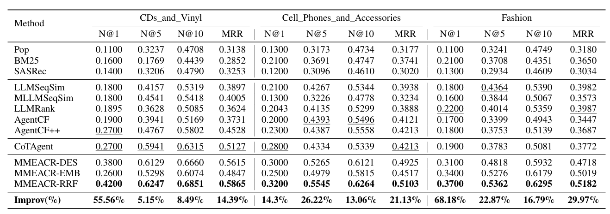

# Seeing and Reflecting: Multimodal Memory-Enhanced Agent Collaboration for Recommendation

## Paper URL: https://arxiv.org/abs/2607.07108

We introduce MMEACR, a Multimodal Memory-Enhanced Agent Collaboration for Recommendation
<div align="center">
  
</div>

MMEACR achieves great improvement in CDs, Cell Phones and Fashion in benchmark
<div align="center">
  
</div>


## Data process

You can download dataset from .......

```bash
python dataPrepare.py
```


## Agent Training

```bash
python AgentCF_train_check.py
```


## Agent Testing

```bash
python AgentCF_Test_log-.py
```

## Proxy Configuration
request.py是负责gpt系列的api, request1.py是负责glm系列的api(这里使用的模型是gpt-4o和glm-4.5)
注意修改使用不同系列模型的时候train文件和test文件的import都要修改看是request1还是request的python文件。同时还要在config.py文件里面修改model = "glm-4.5"还是 model = "gpt-4o"

## bash 运行训练和测试
```bash
bash run_train_and_test.sh
```

## bash 运行训练和测试Reflection
```bash
bash run_train_and_test_for_reflection.sh
```
